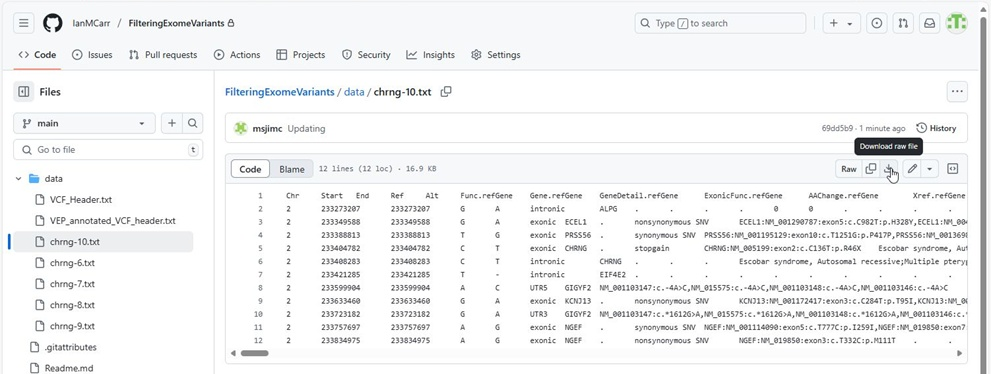
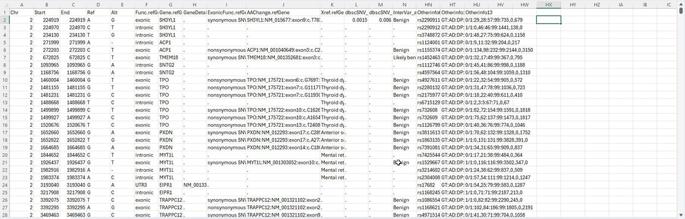
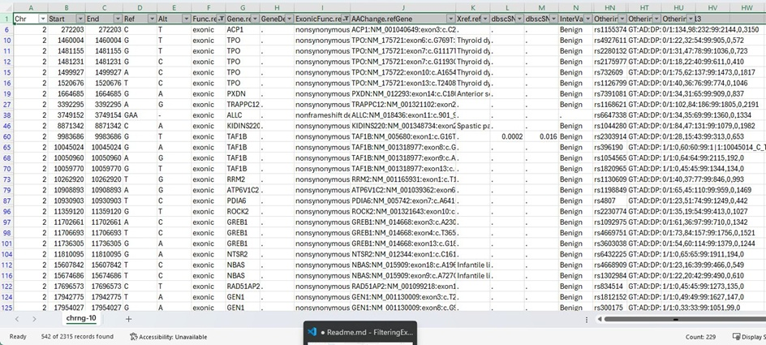
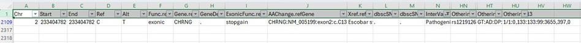
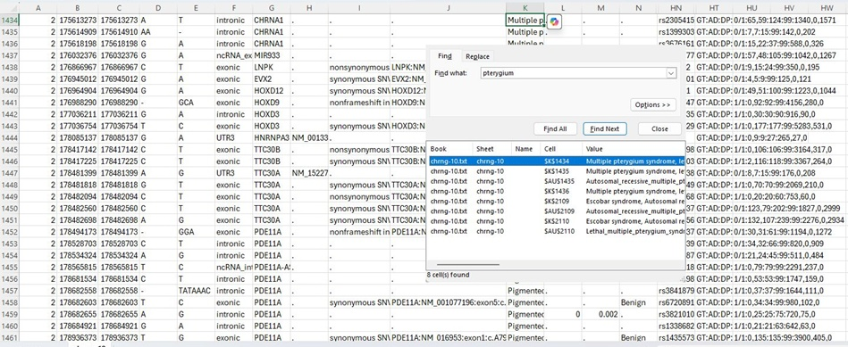
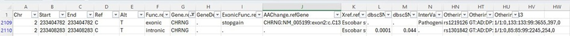
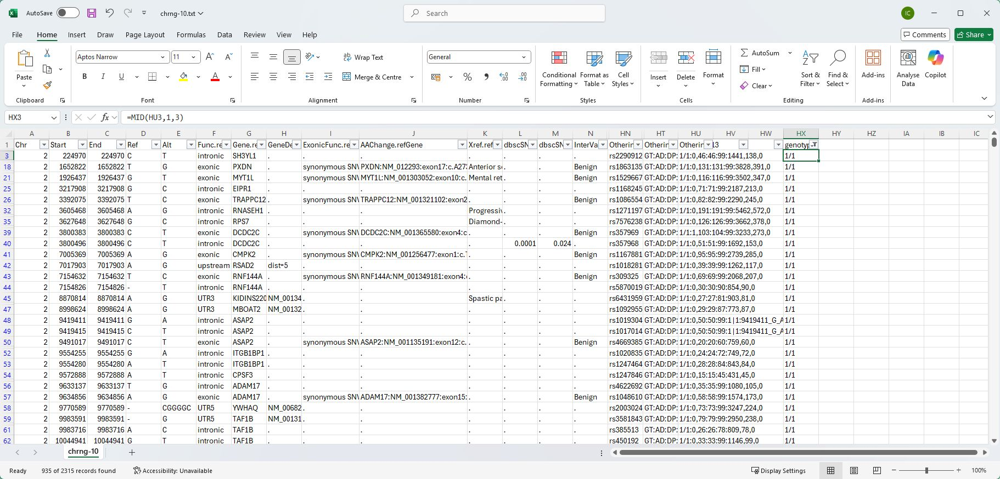
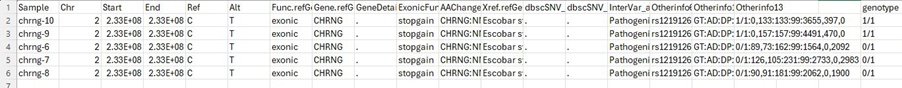

# Filtering annotated exome variants

## Basic information  
When calling variants from aligned exome data, the variants are typically saved in VCF files. These are text based files and so can be read in any text editor like Notepad or preferably Notepad++. Since one line contains data on one variant it is best to use a program that either doesn't wordwrap or allows it to be turned off. An example VCF file is [here](data/VCF_Header.txt). This file contains all the descriptor columns plus a few variant entires. While the file is human readable, its format is not that easy to read especially considering a typical exome data set may have about 35k variants. 

Each variant in an unannotated VCF files always contains data on it's position, RS ID, reference and alternative alleles. It may also contain a quality score and whether it passed filtering. This data is stored 7 columns of data, with the eighth column containing a series of optional data values as key: data pairs separated by a __;__ such as BaseQRankSum=-0.134;ClippingRankSum=-0.325. A description of each key:value pair is given in the head section for example:

##INFO=<ID=BaseQRankSum,Number=1,Type=Float,Description="Z-score from Wilcoxon rank sum test of Alt Vs. Ref base qualities">  
##INFO=<ID=ClippingRankSum,Number=1,Type=Float,Description="Z-score From Wilcoxon rank sum test of Alt vs. Ref number of hard clipped bases">

The ninth column contains a series of option key such as GT:AD:DP with the remaining columns containing the relevant, for instance GT:AD:DP in the ninth column and 0/1:15,13:28 in the tenth column is equivalent to GT = 0/1, AD = 15,13 and DP = 28. The definition of GT, AD and DP is in the header section as: 

##FORMAT=<ID=GT,Number=1,Type=String,Description="Genotype">   
##FORMAT=<ID=AD,Number=R,Type=Integer,Description="Allelic depths for the ref and alt alleles in the order listed">  
##FORMAT=<ID=DP,Number=1,Type=Integer,Description="Approximate read depth (reads with MQ=255 or with bad mates are filtered)">

The genotypes are typically 1/1 for homozygous alternative allele, 0/1 heterozygous and 0/0 wild type (generally not included)

As can be seen from the description above and from viewing the [eaxmple file](data/VCF_Header.txt), VCF files can be hard to interpret. This can become even worse when viewing annotated VCF, such as this [one](data/VEP_annotated_VCF_header.txt) which was annotated by VEP. Consequently, variant data sets are generally filtered using a program or by arranging the data as tab-delimited text files which can be viewed as a spreadsheet. The chrng-*.txt files are examples of variant data from chromosome 2, 233 MB to 234 MB  annotated by Annovar.

## Screening variants by eye

### Getting the data 

The chrng-*.txt files in the data folder contain data two affected siblings chrng-9 and chrng-10 and their parents and unaffected sibling. Download each file by going to the [data folder](data/) and then selecting each file in turn and pressing the download icon in the top right of the webpage (fig. 1)

Figure 1: Clicking the tray icon downloads each current file.

### Values useful for screening the variant data 

In the annotated files there are 229 columns that contain data on various scores and attributes of each variant. If a cell contains a "__.__" it means there is no value for that parameter. 

<b> values that suggest pathogenicity</b>   
These values can give a variant's (if known) allele frequency in different populations (i.e. ExAC_AFR = Africans, ExAC_NFE = Europeans and ExAC_SAS = south Asians), the likely pathogenicity of the variant as scored by a range of methods such as the PVS1, Polyphen and SIFT scores. Deleterious variants would be expected to have a very low allele frequency, PVS1, Polyphen and SIFT score suggesting its likely pathogen. Many disease causing variants are new to science and so will not have and RS ID (column avsnp151), however, if the disease gene is known the causative variant may have been described before and so may have a RS ID, consequently, looking for variants with no RS ID can be go for a quick search, but should not be relied on. 

Figure 2 shows the chrng-10.txt in Excel with a number of columns hidden for easy viewing.

Figure 2: An annotated file open in excel.

### First pass filtering

- The first step in filtering is to remove variant in regions no mapped to the disease. These files only contain data for chromosome 2.
- Most easily verified disease causing variants are in either an exon or at a splicing site. Consequently, filter the variants for those with either exonic or splicing in the __Func.refGene__ column ( column F).
- If you know of genes linked to the phenotype, you can filter by gene name/SYMBOL in the __Gene.refGene__ column (column G) 
- Most disease causing variants modify the protein sequence so you can filter on the __ExonicFunc.refGene__ column (column I) removing any _synonymous SNV_ values. However, splicing variants are listed as a "__.__" so only remove variant that are explicitly known to have no affect.
- If the phenotype has been linked to gene, you can filter the variants on the __Xref.refGene__ column (column K) selecting for variants linked to the disease or similar condition of interest. 
- While the data file contains pathogenicity scores from a range of scoring methods, the __InterVar_automated__ column (column N) aggregates these scores, allowing you to filter on value Pathogenic.
- An important value t filter on is the genotype, the varaint should be homozygous alterative allele in the affected individuals and either heterozygous or homozygous wild type in unaffected individuals. 

### Examples

This strategy outlined above while identify a likely pathogenic variant in a large number of cases, if it fails, then the analysis rapidly becomes a far more complex task. The Figures below show the data file shown in Figure 2 after filtering for a range of values. 

<b>Note:</b> The unfiltered file has 2315 variants.

Figure 3: Filtering variant for __exonic__ or __splicing__ and removing synonymous SNV variants reduced the list to 542 variants.

Figure 4: Filtering variant for __Pathogenic__ variants reduced the list to 1 variants.

Figure 2: Filtering for variants linked to __pterygium__ phenotype reduced the list to 8 variants

Figure 6: Filtering for variants in the ___CHRNG___ gene reduced the list to 2 variants

Figure 7: FFiltering variant for __exonic__ or __splicing__ and removing synonymous SNV variants reduced the list to 542 variants. However, by adding a new column that only contains the first 3 characters of the last column is possible to filter on genotype with 1/1 indicating a homozygous alternative variant. This reduces the list from 542 variants to 298.

The code to select the first three letters is  
> =mid(HU1,1,3)

 where HU1 is the last cell on the first line. For the genotype of the variant on line two use  
 >=mid(HU2,1,3).

Figure 8: When the pathogenic variant's genotypes for the individuals is examined, it is found to segregate with disease status.

